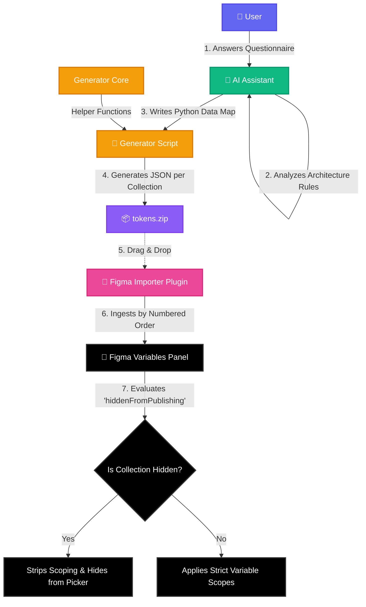

# Figma Variables Generator Ecosystem

This project consists of two core components working in tandem to automate the creation and structuring of complex design tokens directly inside Figma.

1. **The AI Skill**: An expert AI prompt architecture that guides you through building a token system and generates a highly structured ZIP of W3C-compliant JSON files.
2. **[Variables Tokens Collections Importer](https://www.figma.com/community/plugin/1619733963699677957)** (v3.0 Stable): A dedicated Figma plugin that reads the ZIP file and automatically imports all collections in the precise dependency order required by Figma.

---

### Ecosystem Workflow



---
## 1. The AI Skill: How it Works

The AI Skill acts as an expert token architect (understanding both product design and frontend engineering). 

When triggered, it:
1. **Interviews You**: Asks targeted questions using structured dropdowns to establish your brand colors, spacing, typography, and desired architecture (Tier 1 through 4).
2. **Validates Scope**: Ensures all tokens are built with strict Figma scoping rules (e.g., locking background colors to `FRAME_FILL`).
3. **Generates ZIP Files**: Uses a Python-based Smart SDK with declarative Builder APIs to generate the entire deterministic system in a single-shot execution, preventing LLM context exhaustion. It produces a final ZIP inside an `exports/` folder where collections are stored under numeric paths (e.g., `1. Primitives/`, `2. Theme/`).
4. **Maintains Stability**: Guarantees ID stability across modes and correct alias chain references.

### How to Import the Skill

**⚡ Quick Install (Recommended)**  
The `skills.sh` registry supports over 40+ coding agents (including Claude Code, Cursor, OpenCode, Windsurf, Copilot, and Gemini). You can install this skill instantly into your project by running:

```bash
npx skills add Shanmus4/figma-variables-tokens-generator
```

*(Optional)* To install it globally for all agents or restrict it to specific agents, append these flags:
```bash
npx skills add Shanmus4/figma-variables-tokens-generator -g               # Install globally
npx skills add Shanmus4/figma-variables-tokens-generator -a claude-code   # Install to Claude Code only
```

Depending on your environment, there are also manual ways to utilize the Figma Variables Tokens Generator Skill:

| AI Environment | Import & Installation Method |
|----------------|------------------------------|
| **1-Click Install (`npx skills`)** | Run `npx skills add Shanmus4/figma-variables-tokens-generator` in your project terminal. It auto-detects and installs into your agent workspace (Claude Code, Cursor, Gemini, OpenCode, etc.). |
| **Cursor IDE** | Download and unzip `figma-variables-tokens-generator.zip` from the Releases tab. Copy the folder to `.cursor/skills/figma-tokens/` in your workspace, or simply attach the folder context manually in chat using `@Folder`. |
| **Claude Code (CLI)** | Download and unzip `figma-variables-tokens-generator.zip` from the Releases tab. Extract the folder into `.claude/skills/figma-tokens/` within your project. Claude Code will automatically detect and read the skill instructions. |
| **Gemini CLI** | Download and unzip `figma-variables-tokens-generator.zip` from the Releases tab. Extract the folder into `.gemini/skills/figma-tokens/` within your project to load it as an on-demand Agent Skill. |
| **OpenCode IDE** | Download and unzip `figma-variables-tokens-generator.zip` from the Releases tab. Extract into `.claude/skills/figma-tokens/` (OpenCode natively supports this standard) or reference the files in your `AGENTS.md`. |
| **OpenAI Codex CLI** | Download and unzip `figma-variables-tokens-generator.zip` from the Releases tab. Extract the folder to your workspace and reference it in your `AGENTS.md` file, or append it via the `--append-system-prompt-file` flag. |
| **Windsurf IDE** | Download and unzip `figma-variables-tokens-generator.zip` from the Releases tab. Extract the folder to your workspace. Reference it in your `.windsurf/rules/rules.md` file, or attach the folder directly to Cascade. |
| **VS Code (Copilot / Cline)** | Download and unzip `figma-variables-tokens-generator.zip` from the Releases tab. Extract the folder into your workspace. Tell Copilot to read the files via `@workspace` instructions, or allow Cline to read the folder contents. |
| **Claude.ai / Claude Desktop** | Download `figma-variables-tokens-generator.zip` from the Releases tab. Go to **Connectors -> Skills** in Claude, and upload the ZIP file directly. |
| **Manual (One-Click ZIP)** | Go to the **Releases** tab on the right side of this GitHub repository page and download `figma-variables-tokens-generator.zip`. |

---

## 2. The Figma Plugin: How it Works

Because of Figma's strict dependency requirements, variables must be imported starting from the root parent (Primitives) up to the final component tokens. 

The **Figma Variables Importer Plugin (v2.0 Stable)** automatically resolves this. It reads the prefixed folder numbers generated by the AI (e.g., `1. Primitives/`) and sequentially imports them, ensuring that aliased variables never drop references.

The same plugin can also:
- **Export** your existing Figma variables as a ZIP for the AI to analyze before generation
- **Update** an existing design system in place by importing over it using the plugin's synchronization flow

### How to Install the Plugin

| Environment | Install Instruction |
|-------------|--------------------|
| **Figma Community** | [Install Variables Tokens Collections Importer](https://www.figma.com/community/plugin/1619733963699677957) |
| **Local Development** | 1. Go to the **Releases** tab on this GitHub repository and download `token-import-plugin-figma.zip`.<br>2. Unzip it to a folder on your computer.<br>3. Open Figma desktop app.<br>4. Go to **Plugins -> Manage Plugins -> Development -> Import plugin from manifest**.<br>5. Select the `manifest.json` inside the unzipped folder. |

---

## 2.1 Error Recovery & Updates

AI can still make mistakes, especially in highly dynamic architectures with many custom collections, modes, or alias chains.

If the plugin reports import errors:
1. Copy the error output from the plugin
2. Paste it back to the AI
3. Ask the AI to fix the token package

If you need to change colors, naming, collections, scopes, modes, or component coverage later, just tell the AI what to update. You can then re-import the revised ZIP through **Variables Tokens Collections Importer** and synchronize it over your existing design system.

---

## 3. Token Architecture & Collections

The Skill supports building scalable systems from 1 to 4 Tiers. We utilize "Tiers" to define the depth of the alias chain.

### Tier Options

| Architecture | Best For | Description |
|--------------|----------|-------------|
| **1-Tier (Flat)** | Small prototypes | Raw values only (e.g. \`blue-500\`). Not scalable. |
| **2-Tier (Semantic)** | Standard apps | `Semantic` (light/dark modes) → `Primitives`. |
| **3-Tier (Component)** | Production apps | `Component` → `Semantic` (light/dark modes) → `Primitives`. |
| **4-Tier (Enterprise)** | Multi-brand/White-label | `Component` → `Semantic` (no modes) → `Theme` (palette-switching) → `Primitives`. |

### Core Collections Matrix

| Collection Name | Tier Level | Function |
|-----------------|------------|----------|
| **Primitives** | All Tiers | The foundational base (hex codes, actual spacing values). Hidden from publishing. |
| **Theme** | 4 Only | A palette-switching mode layer (Light/Dark) strictly for enterprise multi-brand systems. Hidden from publishing. |
| **Responsive** | Optional | Viewport-based value mapping (Mobile, Tablet, Desktop) for numerical tokens. Hidden from publishing. |
| **Density** | Optional | Spacing mappings (Compact, Comfortable, Spacious) across 6 padding directions and gap. Hidden from publishing. |
| **Layout** | Optional | Breakpoint-driven grid parameters (columns, margins, gutters). |
| **Effects** | Optional | Shadow geometry and blurs for UI components. |
| **Typography** | All Tiers | Centralized text styling referencing Responsive sizes and Primitives fonts. |
| **Semantic** | 2, 3, 4 | The core mode-switching layer (Light/Dark) for 2/3-Tier, or a mode-less semantic intent layer in 4-Tier systems. |
| **Component Colors** | 3, 4 | Exact surface and text colors scoped down to specific component states (e.g., Button Hover). |
| **Component Dimensions** | 3, 4 | Exact sizing and spacing for components referencing Responsive and Density scales. |

---

## Licensing

- **Root Repository:** [Apache License 2.0](./LICENSE)
- **Figma Variables Generator Skill:** [Proprietary Source Available License](./figma-variables-tokens-generator/LICENSE) — Protects architectural logic and prohibits unauthorized redistribution or commercial exploitation.

---

## Updating

If a new version of this skill is released with updated rules or bug fixes, you can update it right from your terminal.

**To update this specific skill:**
Re-run the install command. The CLI detects the existing folder and updates it in place.
```bash
npx skills add Shanmus4/figma-variables-tokens-generator
```

**To update all installed skills across your system:**
```bash
npx skills update
```

---

## Uninstalling

If you installed the skill via `npx skills`, you can quickly remove it using the interactive removal menu:

```bash
npx skills remove
```

*(Optional)* Or you can run exact removal commands depending on how you originally installed it:

```bash
# 1. Project Level: Removes from your current folder's agents
npx skills remove figma-variables-tokens-generator

# 2. Global Level: Removes from all agents across your entire computer
npx skills remove figma-variables-tokens-generator -g

# 3. Specific Agent Only: Removes ONLY from Claude Code locally
npx skills remove figma-variables-tokens-generator -a claude-code
```
